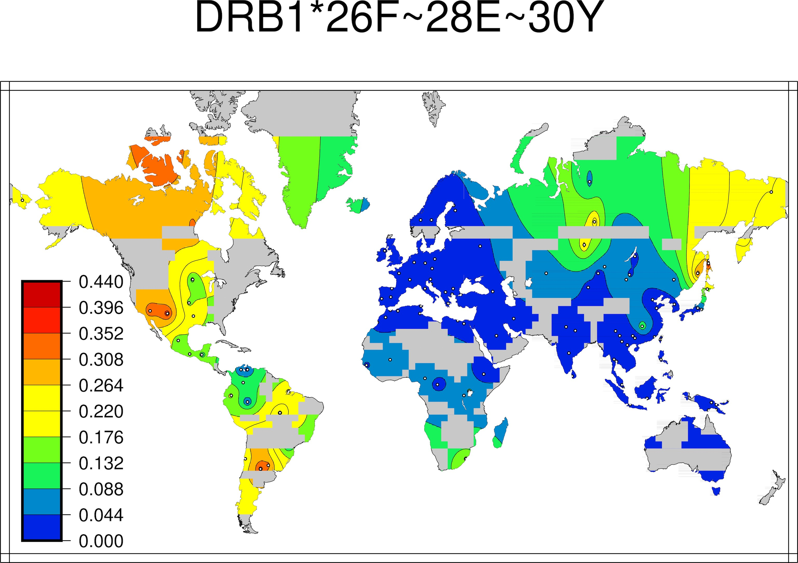
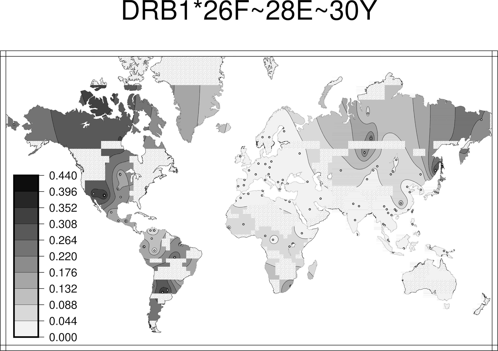

```{r setup, include=FALSE}
knitr::opts_chunk$set(echo = TRUE)
```

* Package Version: 0.8.3.9000

# Overview
The Searching Shared HLA Amino Acid Residue Prevalence (SSHAARP) Package processes amino acid alignments produced by the IPD-IMGT/HLA Database to identify user-defined amino acid residue motifs shared across HLA alleles, and calculates the frequencies of those motifs based on HLA allele frequency data. SSHAARP uses Generic Mapping Tools (GMT) software and the GMT R Package to generate global frequency heat maps that illustrate the distribution of each user-defined map around the globe. SSHAARP analyzes the allele frequency data described in Solberg et al. 2008, a global set of 497 population samples from 185 published datasets, representing 66,800 individuals.

Future plans for SSHAARP include producing heat maps based on allelic frequencies obtained from the Allele Frequency Net Database (AFND). 

SSHAARP obtains HLA amino acid alignments from the ANHIG/IMGTHLA GitHub repository at: https://github.com/ANHIG/IMGTHLA/tree/Latest/alignments.

The required Solberg dataset (See: doi: 10.1016/j.humimm.2008.05.001) file is the 1-locus-alleles.dat file in the results.zip archive at http://pypop.org/popdata/. The Solberg dataset is also incorporated into SSHAARP as "solberg_dataset". Columns of the Solberg dataset that are pertinent to this package, along with an explanation of their contents, are as follows: 
  
  **popname** - contains the population name, followed by a year, indicating the year of publication of the literature the population information was derived from

  **contin** - contains three letter abbreviations of 10 major world regions:
  
        AUS - Australia
        EUR - Europe
        NAF - north Africa
        NAM - North America
        NEA - northeast Asia
        OCE - Oceania
        SAM - South America
        SEA - southeast Asia
        SSA - sub-Saharan Africa
        SWA - southwest Asia

  Significantly admixed populations were placed in an **'OTH'**, or other, group
    
  **complex** - assigns level of complexity, ranging from 1 (least complex) to 3 (most complex), which estimates the degree of potential admixture in a population sample. Complexity values suffixed with 'mig' indicate migrant populations.
    
  **latit** - latitude coordinates of the population.
    
  **longit** - longitude coordinates of the population.
    
  **locus** - HLA locus information of collected data.
    
  **allele_v3** - IPD-IMGT/HLA Database version 3.\*.\* allele names.
    
  **allele.freq** - frequency of the corresponding HLA allele for a population.       

***

SSHAARP’s functions interact with two data sources, protein alignments from the ANHIG/IMGTHLA Github Repository and the Solberg dataset, both of which are packaged into SSHAARP, and one R package:

1. ANHIG/IMGTHLA:
    
    **countSpaces()** counts the number of whitespaces in the ANHIG alignment files to discern where the alignment start is.
    
    **BLAASD()** extracts alignment sequence information for a given locus from the ANHIG/IMGTHLA Github repository to produce a dataframe of amino acid sequence data for each individual peptide position for all alleles.
    
      **findMotif()** reduces the data frame of individual amino acid positions produced by BLAASD() to alleles with the user-defined motif.
      
2. Solberg dataset:
  
      **dataSubset()** returns a modified version of the Solberg dataset that includes a column of locus*allele names, is sorted by by population name, is reduced to the specified locus, and contains Cartesian instead of cardinal coordinates in the latitude and longitude columns .
  
3. Generic Mapping Tools (GMT)

      **PALM()** applies the Generic Mapping Tools (gmt) R package to the modified Solberg data to produce heatmaps. The gmt R package is an interface between R and the GMT Map-Making software, and is required for the PALM() function. Both the gmt R package **AND** GMT software (available at: https://www.soest.hawaii.edu/gmt/) must be installed to run SSHAARP.
      
---

## Functions

### BLAASD()
BLAASD() extracts alignment sequence information for a given locus from the ANHIG/IMGTHLA GitHub repository to produce a data frame of individual amino acid data for each amino acid position for all alleles. The first 4 columns are locus, allele, trimmed allele, and allele_name, as shown below.

```
Example output of BLAASD() for HLA-A, where the selected row outputs are 2 and 8 to illustrate different HLA-A alleles, and selected columns are the first 19 columns of the dataframe, where the first 4 columns consist of the locus, allele, trimmed_allele of 2 fields, and the full allele name. The rest of the columns consist of corresponding amino acids for each amino acid position for a given allele:

>BLAASD("A")[[1]][c(2,8),1:19]
  locus       allele trimmed_allele    allele_name -24 -23 -22 -21 -20 -19 -18 -17 -16 -15 -14 -13 -12 -11 -10
2     A 01:01:01:02N        A*01:01 A*01:01:01:02N   M   A   V   M   A   P   R   T   L   L   L   L   L   S   G
8     A  01:01:01:08        A*01:01  A*01:01:01:08   M   A   V   M   A   P   R   T   L   L   L   L   L   S   G
```

### checkMotif()
checkMotif() checks the user-input motif for formatting errors, and examines the amino acid positions to see if they are in the alignment. If a formatting error or non-existent amino acid position is found in the user-input motif, an error message is returned. Otherwise, a list object containing the locus, motif, and HLAalignments is returned.

```
Example output of checkMotif() for a motif with existent amino acid positions and no formatting errors:

> checkMotif("DRB1*26F~28E~30Y")
[[1]]
[1] "DRB1"

[[2]]
[1] "26F" "28E" "30Y"

[[3]]
[[3]]$DRB1
  locus   allele trimmed_allele   allele_name -29 -28 -27 -26 -25 -24
1  DRB1 01:01:01     DRB1*01:01 DRB1*01:01:01   M   V   C   L   K   L
2  DRB1 01:01:02     DRB1*01:01 DRB1*01:01:02   *   *   *   *   *   *
3  DRB1 01:01:03     DRB1*01:01 DRB1*01:01:03   *   *   *   *   *   *
  -23 -22 -21 -20 -19 -18 -17 -16 -15 -14 -13 -12 -11 -10 -9 -8 -7 -6 -5
1   P   G   G   S   C   M   T   A   L   T   V   T   L   M  V  L  S  S  P
2   *   *   *   *   *   *   *   *   *   *   *   *   *   *  *  *  *  *  *
3   *   *   *   *   *   *   *   *   *   *   *   *   *   *  *  *  *  *  *
  -4 -3 -2 -1 1 2 3 4 5 6 7 8 9 10 11 12 13 14 15 16 17 18 19 20 21 22
1  L  A  L  A G D T R P R F L W  Q  L  K  F  E  C  H  F  F  N  G  T  E
2  *  *  *  * * * * * * R F L W  Q  L  K  F  E  C  H  F  F  N  G  T  E
3  *  *  *  * * * * * * R F L W  Q  L  K  F  E  C  H  F  F  N  G  T  E
  23 24 25 26 InDel_1 27 28 29 30 31 32 33 34 35 36 37 38 39 40 41 42 43
1  R  V  R  L       .  L  E  R  C  I  Y  N  Q  E  E  S  V  R  F  D  S  D
2  R  V  R  L       .  L  E  R  C  I  Y  N  Q  E  E  S  V  R  F  D  S  D
3  R  V  R  L       .  L  E  R  C  I  Y  N  Q  E  E  S  V  R  F  D  S  D
  44 45 46 47 48 49 50 51 52 53 54 55 56 57 58 59 60 61 62 63 64 65 66
1  V  G  E  Y  R  A  V  T  E  L  G  R  P  D  A  E  Y  W  N  S  Q  K  D
2  V  G  E  Y  R  A  V  T  E  L  G  R  P  D  A  E  Y  W  N  S  Q  K  D
3  V  G  E  Y  R  A  V  T  E  L  G  R  P  D  A  E  Y  W  N  S  Q  K  D
  67 68 69 70 71 72 73 74 75 76 77 78 79 80 81 82 83 84 85 86 87 88 89
1  L  L  E  Q  R  R  A  A  V  D  T  Y  C  R  H  N  Y  G  V  G  E  S  F
2  L  L  E  Q  R  R  A  A  V  D  T  Y  C  R  H  N  Y  G  V  G  E  S  F
3  L  L  E  Q  R  R  A  A  V  D  T  Y  C  R  H  N  Y  G  V  G  E  S  F
  90 91 92 93 94 95 96 97 98 99 100 101 102 103 104 105 106 107 108 109
1  T  V  Q  R  R  V  E  P  K  V   T   V   Y   P   S   K   T   Q   P   L
2  T  V  Q  R  R  *  *  *  *  *   *   *   *   *   *   *   *   *   *   *
3  T  V  Q  R  R  *  *  *  *  *   *   *   *   *   *   *   *   *   *   *
  110 111 112 113 114 115 116 117 118 119 120 121 122 123 124 125 126
1   Q   H   H   N   L   L   V   C   S   V   S   G   F   Y   P   G   S
2   *   *   *   *   *   *   *   *   *   *   *   *   *   *   *   *   *
3   *   *   *   *   *   *   *   *   *   *   *   *   *   *   *   *   *
  127 128 129 130 131 132 133 134 135 136 137 138 139 140 141 142 143
1   I   E   V   R   W   F   R   N   G   Q   E   E   K   A   G   V   V
2   *   *   *   *   *   *   *   *   *   *   *   *   *   *   *   *   *
3   *   *   *   *   *   *   *   *   *   *   *   *   *   *   *   *   *
  144 145 146 147 148 149 150 151 152 153 154 155 156 157 158 159 160
1   S   T   G   L   I   Q   N   G   D   W   T   F   Q   T   L   V   M
2   *   *   *   *   *   *   *   *   *   *   *   *   *   *   *   *   *
3   *   *   *   *   *   *   *   *   *   *   *   *   *   *   *   *   *
  161 162 163 164 165 166 167 168 169 170 171 172 173 174 175 176 177
1   L   E   T   V   P   R   S   G   E   V   Y   T   C   Q   V   E   H
2   *   *   *   *   *   *   *   *   *   *   *   *   *   *   *   *   *
3   *   *   *   *   *   *   *   *   *   *   *   *   *   *   *   *   *
  178 179 180 181 182 183 184 185 186 187 188 189 190 191 192 193 194
1   P   S   V   T   S   P   L   T   V   E   W   R   A   R   S   E   S
2   *   *   *   *   *   *   *   *   *   *   *   *   *   *   *   *   *
3   *   *   *   *   *   *   *   *   *   *   *   *   *   *   *   *   *
  195 196 197 198 199 200 201 202 203 204 205 206 207 208 209 210 211
1   A   Q   S   K   M   L   S   G   V   G   G   F   V   L   G   L   L
2   *   *   *   *   *   *   *   *   *   *   *   *   *   *   *   *   *
3   *   *   *   *   *   *   *   *   *   *   *   *   *   *   *   *   *
  212 213 214 215 216 217 218 219 220 221 222 223 224 225 226 227 228
1   F   L   G   A   G   L   F   I   Y   F   R   N   Q   K   G   H   S
2   *   *   *   *   *   *   *   *   *   *   *   *   *   *   *   *   *
3   *   *   *   *   *   *   *   *   *   *   *   *   *   *   *   *   *
  229 230 231 232 233 234 235 236 237
1   G   L   Q   P   T   G   F   L   S
2   *   *   *   *   *   *   *   *   *
3   *   *   *   *   *   *   *   *   *
 [ reached 'max' / getOption("max.print") -- omitted 3155 rows ]
```

```
Example of an incorrectly formatted motif, where two asterisks are used to separate the locus and first amino acid position-pair:

> checkMotif("DRB1**26F~28E~30Y")

[1] "Your motif is formatted incorrectly. Please use the Locus*##$~##$~##$ format, where ## identifies a peptide position, and $ identifies an amino acid residue."
```

```
Example of a motif with an amino acid position that does not exist:

> checkMotif("DRB1*26F~28E~300000Y")

[1] "One or more of your amino acid positions is not present in the alignment. Please make sure amino acid positions of interest are present in the current release of ANHIG/IMGTHLA alignments."
```

### findMotif()
findMotif() parses the provided amino-acid motif, which should be written as `locus*##$~##$~##$`, where ## identifies a peptide position, and $ identifies an amino acid residue. Motifs can include any number of amino acids positions. The following output is an example of the 1st, 5th, 9th, and 10th DRB1 alleles that have the `DRB1*26F~28E~30Y` motif. 

```
>findMotif("DRB1*26F~28E~30Y")[c(1,5,9,10), 1:65]

   locus   allele trimmed_allele   allele_name -29 -28 -27 -26 -25 -24 -23 -22 -21 -20 -19 -18 -17
1   DRB1 01:01:01     DRB1*01:01 DRB1*01:01:01   M   V   C   L   K   L   P   G   G   S   C   M   T
5   DRB1 01:01:05     DRB1*01:01 DRB1*01:01:05   *   *   *   *   *   *   *   *   *   *   *   *   *
9   DRB1 01:01:09     DRB1*01:01 DRB1*01:01:09   *   *   *   *   *   *   *   *   *   *   *   *   *
10  DRB1 01:01:10     DRB1*01:01 DRB1*01:01:10   *   *   *   *   *   *   *   *   *   *   *   *   *
   -16 -15 -14 -13 -12 -11 -10 -9 -8 -7 -6 -5 -4 -3 -2 -1 1 2 3 4 5 6 7 8 9 10 11 12 13 14 15 16 17
1    A   L   T   V   T   L   M  V  L  S  S  P  L  A  L  A G D T R P R F L W  Q  L  K  F  E  C  H  F
5    *   *   *   *   *   *   *  *  *  *  *  *  *  *  *  * * * * * * R F L W  Q  L  K  F  E  C  H  F
9    *   *   *   *   *   *   *  *  *  *  *  *  *  *  *  * * * * * * R F L W  Q  L  K  F  E  C  H  F
10   *   *   *   *   *   *   *  *  *  *  *  *  *  *  *  * * * * * * R F L W  Q  L  K  F  E  C  H  F
   18 19 20 21 22 23 24 25 26 InDel_1 27 28 29 30 31
1   F  N  G  T  E  R  V  R  L       .  L  E  R  C  I
5   F  N  G  T  E  R  V  R  L       .  L  E  R  C  I
9   F  N  G  T  E  R  V  R  L       .  L  E  R  C  I
10  F  N  G  T  E  R  V  R  L       .  L  E  R  C  I
```

If a motif is not found, a dataframe with the motif in one column and an error message in another column is output:
```
>findMotif("DRB1*26F~28E~30Z")

             Motif               Error.message
1 DRB1*26F~28E~30Z No alleles match this motif
```

### dataSubset()
dataSubset() returns a modified version of the Solberg dataset that includes a column of locus*allele names, is sorted by by population name, and is reduced to the specified locus. Cardinal coordinates in the latit and longit are converted to their Cartesian equivalents (i.e. 50S is converted to -50).

```
Four lines of the Solberg dataset prior to the application of dataSubset(); note that population names are unsorted, data for multiple HLA loci are included, and coordinates in the latit and longit columns are in cardinal format:

>solberg_dataset[c(1,2,300,600, 1000),]

     dataset     popname contin complex   latit  longit           coord locus allele_v2
1        lit Korean_1999    NEA       3  37.00N 127.30E  37.00N 127.30E  DRB1      1302
2        lit  Gabes_2006    NAF       2     34N     10E         34N 10E  DRB1      1311
300     ihwg      Ami_97    SEA       1 25.067N 121.65E 25.067N 121.65E     B      5601
600     ihwg   Brazilian    OTH    3mig     10S     55W         10S 55W     B      5001
1000    ihwg     Chaouya    NAF       2   35.5N      8W        35.5N 8W     A      2902
     allele_v3 allele.freq allele.count gametes
1        13:02     0.11001          111    1009
2        13:11     0.00526            1     190
300      56:01     0.20408           40     196
600      50:01     0.03371            6     178
1000     29:02     0.06716            9     134
```

```
Five lines of the modified Solberg dataset returned by dataSubset(), where the input dataset is the Solberg dataset; note that population names are in lexicographic order, the only locus returned is the locus provided in the motif (i.e. DRB1), the addition of a new locus_allele column, and coordinates in the latit and longit columns are in Cartesian format:

>dataSubset(solberg_dataset, “DRB1*26F~28E~30Y”)[c(1,2,300,600, 1000),]

      dataset        popname contin complex latit longit         coord locus allele_v2 allele_v3
8615      lit      Ache_2003    SAM       1   -24    -56       24S 56W  DRB1      0403     04:03
8616      lit      Ache_2003    SAM       1   -24    -56       24S 56W  DRB1      0411     04:11
9365      lit      Bari_1994    SAM       2    10    -70       10N 70W  DRB1      0403     04:03
10068     lit Cameroon_2001b    SSA       3     6     12  6.00N 12.00E  DRB1      1102     11:02
10679     lit     Czech_1992    EUR       3 49.45   15.3 49.45N 15.30E  DRB1      0301     03:01
      allele.freq allele.count gametes locus_allele
8615      0.00578            1     173   DRB1*04:03
8616      0.74566          129     173   DRB1*04:11
9365      0.03636            4     110   DRB1*04:03
10068     0.03175            8     252   DRB1*11:02
10679     0.11111           21     189   DRB1*03:01
```

### countSpaces()
countSpaces() returns a vector of the number of spaces between each set of non-space characters in a string.

``` 
#number of whitespaces counted for row 3 in the alignment file 

>countSpaces("ONE TWO  THREE   FOUR")
[1] 1 2 3
``` 

### PALM() 

PALM() produces a frequency heatmap for a specified amino-acid motif, based on the allele frequency data in the Solberg dataset using the Generic Mapping Tools (GMT) R Package, which is an interface between R and the GMT Map-Making software. GMT software is required for this function and can be downloaded at https://www.soest.hawaii.edu/gmt/. The final output of PALM() is a heatmap saved under the filename as "'the input motif'.jpg" as a JPEG in the user's working directory. 

The filename parameter is defaulted to the Solberg dataset in SSHAARP. Two other default parameters are set for PALM(), where color = TRUE and filter_migrant = TRUE. When color is set to TRUE, PALM generates a color heatmap; when color is set to FALSE, a greyscale heatmap is generated. When filter_migrant is set to TRUE, populations from the OTH region and populations with complexity values that have the ‘mig’ suffix are excluded from the heatmap plot. When filter_migrant is set to FALSE, these populations are included in the heatmap plot.

```
#color heatmap plot
>PALM("DRB1*26F~28E~30Y" )
```

```{r, out.width='100%', fig.align='center', fig.cap='...', , echo=FALSE}

```
  
```
#greyscale heatmap plot
>PALM("DRB1*26F~28E~30Y", color=FALSE)
```

```{r, out.width='100%', fig.align='center', fig.cap='...', echo=FALSE}

```
  


