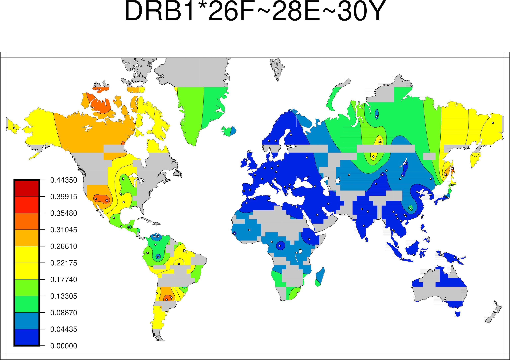

```{r setup, include=FALSE}
knitr::opts_chunk$set(echo = TRUE)
```

* Package Version: 1.0.0

## Overview

The Searching Shared HLA Amino Acid Residue Prevalence (SSHAARP) Package processes amino acid alignments produced by the IPD-IMGT/HLA Database to identify user-defined amino acid residue motifs shared across HLA alleles, and calculates the frequencies of those motifs based on HLA allele frequency data. SSHAARP’s functions interact with protein alignments from the ANHIG/IMGTHLA Github repository (https://github.com/ANHIG/IMGTHLA/tree/Latest/alignments) and the Solberg dataset, both of which are included in the package, and the Generic Mapping Tools (gmt) R package. Details about the Solberg dataset can be found at doi: 10.1016/j.humimm.2008.05.001. The bundled solberg_dataset object is the 1-locus-alleles.dat file in the results.zip archive at http://pypop.org/popdata/. 
The gmt R package requires operating system installations of GMT software (version 5 or 6; available at: https://www.soest.hawaii.edu/gmt/) and Ghostscript (version 9.6 or higher) to generate maps. Earlier versions of Ghostscript may result in the generation of incorrect maps. To determine if maps are being generated correctly, compare maps for the `DRB1*26F~28E~30Y` motif to the examples in this vignette.

## Functions

### BLAASD()
BLAASD() extracts alignment sequence information for a given locus from the ANHIG/IMGTHLA GitHub repository to produce a data frame of individual amino acid data for each amino acid position for all alleles. The first 4 columns are locus, allele, trimmed allele, and allele_name, as shown below.

Most DQ-Beta proteins (e.g., `DQB1*05:01`) lack the eight amino-acids encoded by exon 5 due to an intron 4 splice-acceptor mutation. Some DQB1 alleles (e.g., `DQB1*05:03` and `*06:01`) do not have this intron mutation, and include these eight amino acids. However, because DQB1*05:01 is the DQB1 reference allele, these amino acid positions are represented as insertion positions in the protein alignment generated by the IPD-IMGT/HLA Database. It is not clear how these exon 5-encoded amino acid positions are numbered in the IPD-IMGT/HLA Database; BLAASD() assigns amino-acid position numbers 227-234 to these eight amino-acid indel positions, and the C-terminal DQB1 amino-acid position in the DQB1 protein alignment generated by BLAASD() is position 237.

The output for HLA-DRB3/4/5 will contain DRB1 information for the first row since the reference sequence derived for DRB3/4/5 is from DRB1 in the DRB alignment. 
```
Example output of BLAASD() for HLA-A, where the selected row outputs are 2 and 8 to illustrate different HLA-A alleles, and selected columns are the first 19 columns of the dataframe, where the first 4 columns consist of the locus, allele, trimmed_allele of 2 fields, and the full allele name. The rest of the columns consist of corresponding amino acids for each amino acid position for a given allele:

>BLAASD("A")[[1]][c(2,8),1:19]
  locus       allele trimmed_allele    allele_name -24 -23 -22 -21 -20 -19 -18 -17 -16 -15 -14 -13 -12 -11 -10
2     A 01:01:01:02N        A*01:01 A*01:01:01:02N   M   A   V   M   A   P   R   T   L   L   L   L   L   S   G
8     A  01:01:01:08        A*01:01  A*01:01:01:08   M   A   V   M   A   P   R   T   L   L   L   L   L   S   G
```

### findMotif()
findMotif() parses the provided amino-acid motif, which should be written as `locus*##$~##$~##$`, where ## identifies a peptide position, and $ identifies an amino acid residue. Motifs can include any number of amino acids positions. The following output is an example of the 1st, 5th, 9th, and 10th DRB1 alleles that have the `DRB1*26F~28E~30Y` motif. 

```
>findMotif("DRB1*26F~28E~30Y")[c(1,5,9,10), 1:65]

   locus   allele trimmed_allele   allele_name -29 -28 -27 -26 -25 -24 -23 -22 -21 -20 -19 -18 -17
1   DRB1 01:01:01     DRB1*01:01 DRB1*01:01:01   M   V   C   L   K   L   P   G   G   S   C   M   T
5   DRB1 01:01:05     DRB1*01:01 DRB1*01:01:05   *   *   *   *   *   *   *   *   *   *   *   *   *
9   DRB1 01:01:09     DRB1*01:01 DRB1*01:01:09   *   *   *   *   *   *   *   *   *   *   *   *   *
10  DRB1 01:01:10     DRB1*01:01 DRB1*01:01:10   *   *   *   *   *   *   *   *   *   *   *   *   *
   -16 -15 -14 -13 -12 -11 -10 -9 -8 -7 -6 -5 -4 -3 -2 -1 1 2 3 4 5 6 7 8 9 10 11 12 13 14 15 16 17
1    A   L   T   V   T   L   M  V  L  S  S  P  L  A  L  A G D T R P R F L W  Q  L  K  F  E  C  H  F
5    *   *   *   *   *   *   *  *  *  *  *  *  *  *  *  * * * * * * R F L W  Q  L  K  F  E  C  H  F
9    *   *   *   *   *   *   *  *  *  *  *  *  *  *  *  * * * * * * R F L W  Q  L  K  F  E  C  H  F
10   *   *   *   *   *   *   *  *  *  *  *  *  *  *  *  * * * * * * R F L W  Q  L  K  F  E  C  H  F
   18 19 20 21 22 23 24 25 26 INDEL-1 27 28 29 30 31
1   F  N  G  T  E  R  V  R  L       .  L  E  R  C  I
5   F  N  G  T  E  R  V  R  L       .  L  E  R  C  I
9   F  N  G  T  E  R  V  R  L       .  L  E  R  C  I
10  F  N  G  T  E  R  V  R  L       .  L  E  R  C  I
```

If a motif is not found, a dataframe with the motif in one column and an error message in another column is output:
```
>findMotif("DRB1*26F~28E~30Z")

             Motif               Error.message
1 DRB1*26F~28E~30Z No alleles match this motif
```

### PALM() 

PALM() produces a frequency heatmap for a specified amino-acid motif, based on the allele frequency data in the Solberg dataset using the Generic Mapping Tools (GMT) R Package, which is an interface between R and the GMT Map-Making software. GMT software is required for this function and can be downloaded at https://www.soest.hawaii.edu/gmt/. The final output of PALM() is a heatmap saved under the filename as "'the input motif'.jpg" as a JPEG in the user's working directory. Ghostscript, an interpreter for Postscript (.ps files), is needed to convert the .ps file produced by GMT into a .jpg file. Users should have the >= 9.26 version of Ghostscript downloaded; earlier versions of Ghostscript result in a problem with layering during the conversion from .ps to .jpg. For verification on whether maps are being generated correctly, users may check the motif `DRB1*26F~28E~30Y` against the examples in the vignette.

The filename parameter is defaulted to the Solberg dataset in SSHAARP. Two other default parameters are set for PALM(), where color = TRUE and filter_migrant = TRUE. When color is set to TRUE, PALM generates a color heatmap; when color is set to FALSE, a greyscale heatmap is generated. When filter_migrant is set to TRUE, populations from the OTH region and populations with complexity values that have the ‘mig’ suffix are excluded from the heatmap plot. When filter_migrant is set to FALSE, these populations are included in the heatmap plot.

Note: While the legend in the maps contains the highest frequency value, it may not be visible on the map because frequencies are averaged over certain geographical areas.

```
#color heatmap plot
>PALM("DRB1*26F~28E~30Y")
```

```{r, out.width='100%', fig.align='center', fig.cap='...', , echo=FALSE}

```
  
```
#greyscale heatmap plot
>PALM("DRB1*26F~28E~30Y", color=FALSE)
```

```{r, out.width='100%', fig.align='center', fig.cap='...', echo=FALSE}
knitr::include_graphics("basemap_bw.jpg")
```
  
```
#if an amino acid motif is not found in the Solberg dataset, an error message is output

>PALM("DRB1*-25R~13S~16H~26Y~47Y~86V")
                          Motif                                        Error.message DRB1*-25R~13S~16H~26Y~47Y~86V No alleles in the Solberg dataset possess this motif
```

