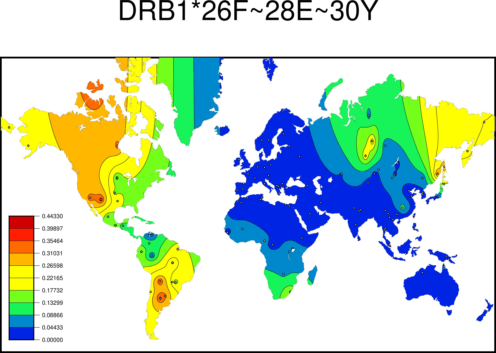

```{r setup, include=FALSE}
knitr::opts_chunk$set(echo = TRUE)
```

* Package Version: 2.0.0

## Overview

The Searching Shared HLA Amino Acid Residue Prevalence (SSHAARP) Package processes alignment files produced by the IPD-IMGT/HLA Database to identify user-defined amino acid residue motifs across HLA alleles, HLA alleles, or HLA haplotypes, and calculates frequencies of the selected variant based on HLA allele frequency or haplotype data. SSHAARP’s functions interact with protein alignments from the ANHIG/IMGTHLA Github repository (https://github.com/ANHIG/IMGTHLA/tree/Latest/alignments) and the Solberg dataset, a user provided allele dataset formatted like the Solberg dataset, a mock haplotype dataset, or a user provided dataset formatted like the mock haplotype dataset. SSHAARP's functions also interact with the Generic Mapping Tools (gmt) R package. The protein alignments, Solberg dataset, and mock haplotype dataset are included in the package. Details about the Solberg dataset can be found at doi: 10.1016/j.humimm.2008.05.001. The bundled solberg_dataset object is the 1-locus-alleles.dat file in the results.zip archive at http://pypop.org/popdata/.
The gmt R package requires operating system installations of GMT software (version 5 or 6; available at: https://www.soest.hawaii.edu/gmt/) and Ghostscript (version 9.6 or higher) to generate maps. Earlier versions of Ghostscript may result in the generation of incorrect maps. To determine if maps are being generated correctly, compare maps for the `DRB1*26F~28E~30Y` motif to the examples in this vignette.

## IMGTprotalignments 
IMGTprotalignments is a list object containing protein alignments for all protein coding genes in the 3.43.0 IPD-IMGT/HLA Database release. The first 4 columns are locus, allele, trimmed allele, and allele_name. inDels are recorded as decimal enumerations of the previous amino acid position.


```
#Example of decimal enumerations for inDels
> IMGTprotalignments$A[1:3, 1:27]
  locus       allele trimmed_allele    allele_name -24 -23 -22 -21 -20 -19 -18 -17 -16 -15 -14 -13 -12 -11 -10 -9
1     A  01:01:01:01        A*01:01  A*01:01:01:01   M   A   V   M   A   P   R   T   L   L   L   L   L   S   G  A
2     A 01:01:01:02N        A*01:01 A*01:01:01:02N   M   A   V   M   A   P   R   T   L   L   L   L   L   S   G  A
3     A  01:01:01:03        A*01:01  A*01:01:01:03   M   A   V   M   A   P   R   T   L   L   L   L   L   S   G  A
  -8 -7 -6 -6.1 -6.2 -5 -4
1  L  A  L    .    .  T  Q
2  L  A  L    .    .  T  Q
3  L  A  L    .    .  T  Q
```

## Functions
### findMotif()
findMotif() parses the provided amino-acid motif and looks for it in the user specified dataset. The motif should be written as `locus*##$~##$~##$`, where ## identifies a peptide position, and $ identifies an amino acid residue. Motifs can include any number of amino acids positions. The following output is an example of the first three DRB1 alleles that have the `DRB1*26F~28E~30Y` motif. 

```
> findMotif("DRB1*26F~28E~30Y", SSHAARP::solberg_dataset)[1:3,1:65]
    locus   allele trimmed_allele   allele_name -29 -28 -27 -26 -25 -24 -23 -22 -21 -20 -19 -18 -17 -16 -15 -14 -13
215  DRB1 03:02:01     DRB1*03:02 DRB1*03:02:01   M   V   C   L   R   L   P   G   G   S   C   M   A   V   L   T   V
216  DRB1 03:02:02     DRB1*03:02 DRB1*03:02:02   *   *   *   *   *   *   *   *   *   *   *   *   *   *   *   *   *
217  DRB1 03:02:03     DRB1*03:02 DRB1*03:02:03   *   *   *   *   *   *   *   *   *   *   *   *   *   *   *   *   *
    -12 -11 -10 -9 -8 -7 -6 -5 -4 -3 -2 -1 1 2 3 4 5 6 7 8 9 10 11 12 13 14 15 16 17 18 19 20 21 22 23 24 25 25.1
215   T   L   M  V  L  S  S  P  L  A  L  A G D T R P R F L E  Y  S  T  S  E  C  H  F  F  N  G  T  E  R  V  R    .
216   *   *   *  *  *  *  *  *  *  *  *  * G D T R P R F L E  Y  S  T  S  E  C  H  F  F  N  G  T  E  R  V  R    .
217   *   *   *  *  *  *  *  *  *  *  *  * * * * * * R F L E  Y  S  T  S  E  C  H  F  F  N  G  T  E  R  V  R    .
    26 27 28 29 30 31
215  F  L  E  R  Y  F
216  F  L  E  R  Y  F
217  F  L  E  R  Y  F
```

If a motif is not found, a vector containing FALSE and an error message is output:
```
>findMotif("DRB1*26F~28E~30Z", filename=SSHAARP::solberg_dataset)

[1] "FALSE"                                            "DRB1*26F~28E~30Z : No alleles possess this motif"
```

If a motif has formatting errors, a vector containing FALSE and an error message is output:
```
>findMotif("DRB1**27F", filename=SSHAARP::solberg_dataset)

[1] "FALSE"                                                                           
[2] "The amino-acid motif is missing in DRB1**27F. Please use the LOCUS*MOTIF format."
```

If a motif contains an amino acid position not present in IMGTprotalignments, a vector containing FALSE and an error message is output:
```
> findMotif("DRB1*27999F", filename=SSHAARP::solberg_dataset)

[1] "FALSE"                                                                                                                                                                                      
[2] "One or more of your amino acid positions is not present in the alignment. Please make sure amino acid positions of interest are present in the current release of ANHIG/IMGTHLA alignments."
```


### PALM() 

PALM() generates a frequency heatmap for an HLA allele, HLA amino-acid motif, or HLA haplotype. Alleles and amino acid motif maps are generated based on the allele frequency data in the Solberg dataset, or the user provided dataset. Haplotypes maps are generated based on the mock haplotype dataset, or the user specified dataset. User specified datasets MUST follow the same format and convention as the Solberg Dataset or mock haplotype dataset. Maps are created using the gmt R package and the Generic Mapping Tools (GMT) map-making software. GMT software is required for this function and can be downloaded at https://www.soest.hawaii.edu/gmt/.

JPEG heatmap files named “‘variant’.jpg”, where ‘variant’ is an allele, motif, or haplotype, are written to a directory identified by the direct parameter, with the working directory set as the default. The file names of maps generated on Microsoft Windows systems have a different delimiter between the locus name and the amino acid positions; instead of an asterisk (*), a dash (-) is used to accommodate for Windows naming conventions (e.g. `DRB1-26F~28E~30Y`).

The filename parameter is either the full path to the user specified dataset, the Solberg dataset bunded in the package, or the mock haplotype dataset bundled in the package. The variantKind parameter identifies whether the variant entered is an allele, motif, or haplotype. The variantKind parameter must be changed to 'allele' if an allele frequency map is desired, or changed to 'haplotype' if a haplotype frequency map is desired. Alleles in haplotypes may be delimited with "-" or "~". The mask parameter defaults to FALSE, where all areas on the generated map are visible. If mask = TRUE, areas with little to no data table coverage will be masked out. The color and filter_migrant parameters default to TRUE. When color = TRUE, PALM generates a color heatmap; when color = FALSE, a greyscale heatmap is generated. When filterMigrant = TRUE, populations from the OTH region and populations with complexity values suffixed with ‘mig’ are excluded from the heatmap plot. When filter_migrant = FALSE, these populations are included in the heatmap plot. The mapScale parameter determines if the max frequency of the map scale should be 1, or the max frequency of the chosen motif, allele, or haplotype. When mapScale = TRUE, which is the default, the max frequency of the chosen variant is used. When mapScale=FALSE, the max frequency is 1. 

If an allele with more than two fields is entered and the Solberg dataset is selected as the data source, the allele will automatically be truncated to two fields, as the Solberg dataset only contains two field alleles. 

The Ghostscript software suite (>= version 9.26) is required to generate the heatmap file. Versions of Ghostscript < 9.26 introduce a layering error during heatmap generation. To determine if maps are being generated correctly, compare heatmaps of the `DRB1*26F~28E~30Y` motif (with filter_migrant = TRUE) against the examples in this vignette.

Note: While the map legend identifies the highest frequency value, values in this range may not be represented on the map due to frequency averaging over neighboring populations.

```
#color motif heatmap plot with masking ON
>PALM("DRB1*26F~28E~30Y", variantKind="motif", filename=SSHAARP::solberg_dataset)
```

```{r, out.width='100%', fig.align='center', fig.cap='...', , echo=FALSE}

```
  
```
#greyscale motif heatmap plot with masking ON
>PALM("DRB1*26F~28E~30Y", mask = T, color=FALSE, variantKind="motif", filename=SSHAARP::solberg_dataset)
```

```{r, out.width='100%', fig.align='center', fig.cap='...', echo=FALSE}
knitr::include_graphics("basemap_bw.jpg")
```

```
#color allele heatmap plot with masking OFF
> PALM("DRB1*01:01", variantKind="allele", filename=SSHAARP::solberg_dataset)
```

```{r, out.width='100%', fig.align='center', fig.cap='...', echo=FALSE}
knitr::include_graphics("allele_color.jpg")
```

```
#gresyscale allele heatmap plot with masking OFF
> PALM("DRB1*01:01", variantKind="allele", color=F, filename=SSHAARP::solberg_dataset)
```

```{r, out.width='100%', fig.align='center', fig.cap='...', echo=FALSE}

```

```
#if the locus of a variant is valid but not in the Solberg dataset, a warning message is output:
> PALM("TAP1*01:01", variantKind="allele", filename=SSHAARP::solberg_dataset)

Warning message:
In PALM("TAP1*01:01", variantKind = "allele", filename=SSHAARP::solberg_dataset) :
  TAP1 is a valid locus, but is not in the Solberg dataset

#if an amino acid motif is not found in the Solberg dataset, a warning is output:
>PALM("DRB1*-25R~13S~16H~26Y~47Y~86V", variantKind="motif", filename=SSHAARP::solberg_dataset)

Warning message:
In PALM("DRB1*-25R~13S~16H~26Y~47Y~86V", variantKind="motif", filename=SSHAARP::solberg_dataset) :
  DRB1*-25R~13S~16H~26Y~47Y~86V : No alleles possess this motif
  
#if an allele is not found in IMGTprotalignments, a warning is output:
> PALM("DRB1*01999:01", variantKind="allele",filename=SSHAARP::solberg_dataset)

Warning message:
In PALM("DRB1*01999:01", variantKind = "allele", filename=SSHAARP::solberg_dataset) :
  The allele you entered is not present in the current release of ANHIG/IMGTHLA alignments.
  
#if an allele is valid but is not present in the Solberg dataset, a warning is output:
> PALM("A*01:37", variantKind = "allele", filename=SSHAARP::solberg_dataset)

Warning message:
In PALM("A*01:37", variantKind = "allele", filename=SSHAARP::solberg_dataset) :
  The allele entered is a valid allele, but is not present in the Solberg dataset.
  
```
